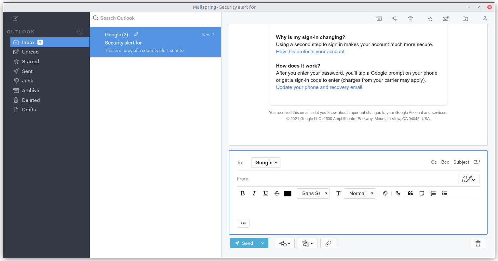
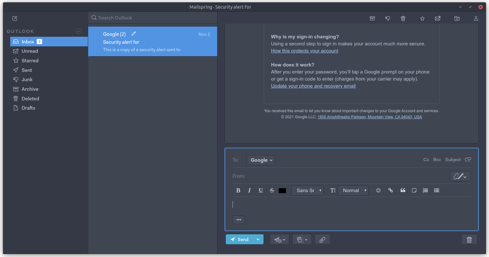
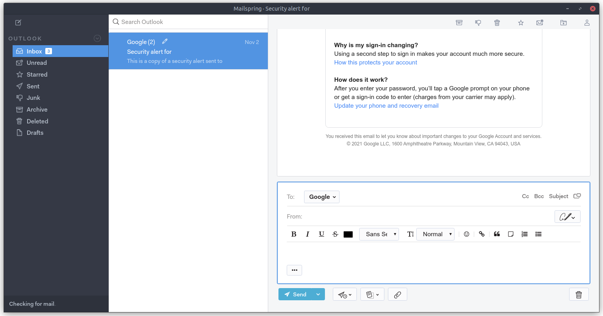
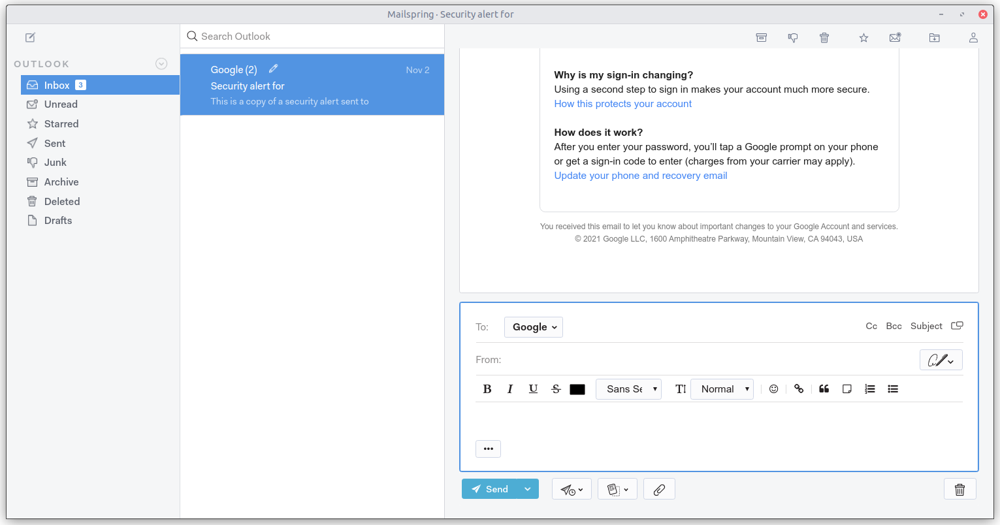

# Mailspring Arc Theme

A theme for [Mailspring](https://github.com/Foundry376/Mailspring) inspired by the [Arc](https://github.com/jnsh/arc-theme) theme.

## Screenshots

### Arc
<div align="left"></div>

### Arc-Dark
<div align="left"></div>

### Arc-Darker
<div align="left"></div>

### Arc-Lighter
<div align="left"></div>

## Installation
Clone the repository:

```bash
git clone https://github.com/drakkar1969/MailSpring-Arc-Theme
```
 Copy the `Arc`, `Arc-Dark`, `Arc-Darker` and `Arc-Lighter` folders to the Mailspring `packages` folder, normally `~/.config/Mailspring/packages`.

Restart Mailspsring and select the theme (`Edit -> Change Theme...`)

### Custom Accent Color

If you are using a custom version of the Arc theme(s) that uses a color that is different from the standard Arc blue (`#5294e2`):
- Open the `arc-variables.less` file in the `styles` subfolder of your chosen theme (e.g. `~/.config/Mailspring/packages/Arc/styles/arc-variables.less`)
- Change the value of the `@clrAccent` variable to your preferred accent color, e.g. Manjaro green (`#34be5b`) or Ubuntu orange (`#dd4814`)
