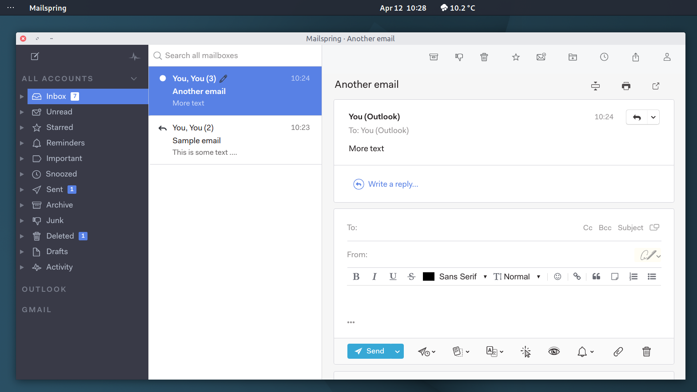

# Mailspring Arc Theme

A theme for [Mailspring](https://github.com/Foundry376/Mailspring) inspired by the [Arc](https://github.com/jnsh/arc-theme) theme.
A project for personal use.

<div align="left"></div>

## Installation
Clone this repository:

```bash
git clone https://github.com/drakkar1969/MailSpring-Arc-Theme
```
 Copy the `Arc` folder to your Mailspring `packages` folder: `~/.config/Mailspring/packages`.

Restart Mailspsring and select the theme (`Edit -> Change Theme...`)
